# T1A3 - Terminal Application Rahal Abeyrathna

A terminal application for the Coder Academy T1A3 assignment.

This application is a Workout Tracker that allows the user to create workout templates, custom exercises and to track their exercise personal bests all within the terminal.

[Github Repository](https://github.com/RAbeyrathna/T1A3-Workout-Tracker)

[Trello Board](https://trello.com/b/OByLchKI/t1a3-workout-tracker)
<!-- [Video Presentation]() -->

## Table of Contents

- [Features](#features)
  - [Custom Exercises](#custom-exercises)
  - [Workout Templates](#workout-templates)
  - [Workout Entries](#workout-entries)
- [Code Style Guide](#code-style-guide)
- [Implementation Plan](#implementation-plan)
  - [Project Management Screenshots](#project-management-screenshots)
- [Help Documentation](#help-documentation)
- [References](#references)

## Features

The application has 3 main CSV's which store the data of exercises, workout templates and completed workout logs. These are crucial for the application to work properly and for the main features to be used.

The applications' main purpose is to track the users PB for exercises they complete during their workouts. It also tracks their working weight throughout the template which gets updated with every workout that uses that selected template.

### Custom Exercises

#### Creating Exercises

The user is able to create any custom exercise by inputting an exercise name and their current PB weight for each exercise.This gets automatically saved into the CSV.

#### Viewing Exercises

The user is able to view a table of all exercises that exist within the CSV file.

#### Deleting Exercises

The exercises are listed with an index next to each exercise. The user is able to type in the index associated to an exercise to delete it permanently from the database. The user is given a confirmation prompt before it is completed.

### Workout Templates

#### Creating Templates

Using the exercises in the database, the user is able to create their own workout templates which save a selection of these exercises under a template name for easy access. The template also tracks the users last recorded workout weight for that specific template. This weight gets updated everytime the user completes a workout entry using the selected template.

#### Viewing Templates

The user is also able to view any templates that have been created in the application. They get a selection of the names of the templates and after selecting one, they get to view the exercises and last recorded workout weight of the template in a table format.

#### Deleting Templates

The user can delete any templates from the CSV within the application if they wish to do so. They will be prompted with a confirmation before the deletion is completed.

### Workout Entries

#### Creating Workout Entries

Using the created templates, the user is able to record a workout entry after selecting a template. The entry then iterates through each exercise stored in the template where the user inputs the highest weight they lifted for that exercise. 

If the user breaks any PB's (if the weight they lifted in the workout is higher than the one stored in the database), then the application will offer to save the new PB's into the database.

### Viewing Previous Workout Entries

The user can view any previous workout logs they completed (they will be saved under the date it was completed). The data is shown in a table with the date, template that was used for the workout and a list of the exercise completed and the weight lifted.

#### Deleting Previous Workout Entries

The user can delete any previous workout entries similar to the above features. They can select the index of the entry they would like to delete and are given a confirmation prompt before the entry is permanently deleted.

The workout logs are stored in an external CSV file.

## Code Style Guide

The code was written referencing the [PEP 8 Style Guide for Python](https://peps.python.org/pep-0008/) using the [Black Code Style and formatter](https://black.readthedocs.io/en/stable/the_black_code_style/current_style.html) as it is PEP8 compliant.

## Implementation Plan

I used Trello to manage my overall project and tasks I had to do, as well as Notion to manage my day to day tasks and help check off things I needed to do in the moment or wanted to delegate to another day.

### Project Management Screenshots

#### Main Trello Board

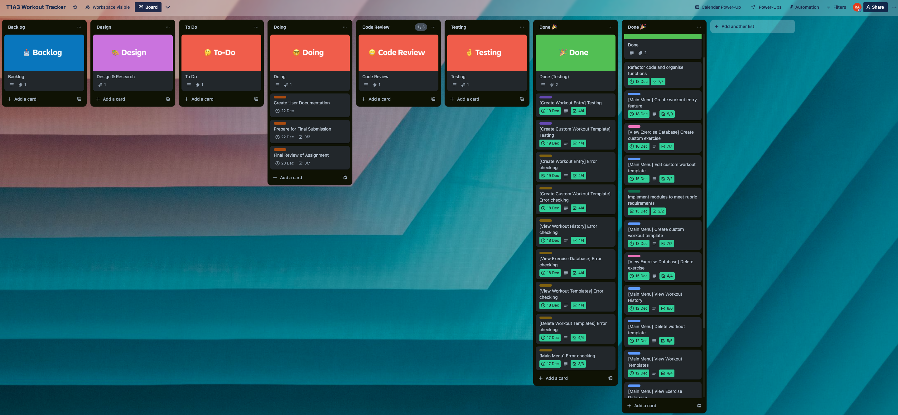

#### Feature Tasks

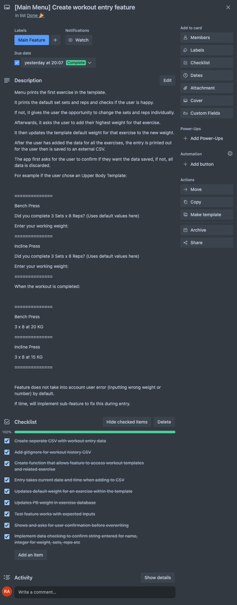

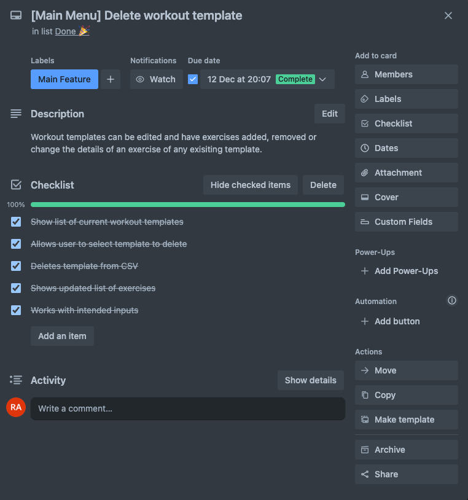

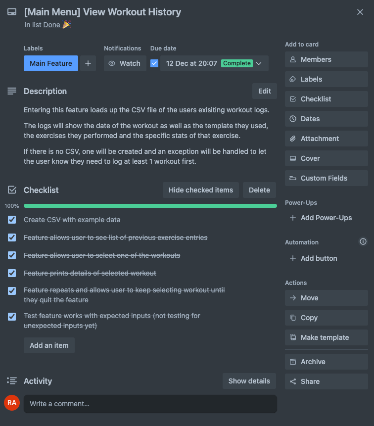

#### Error Checking

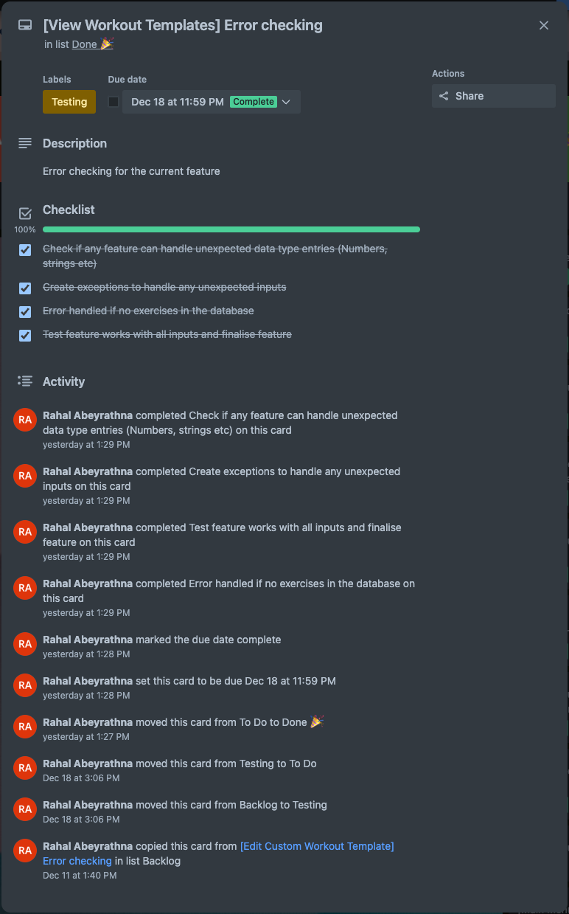

#### Testing

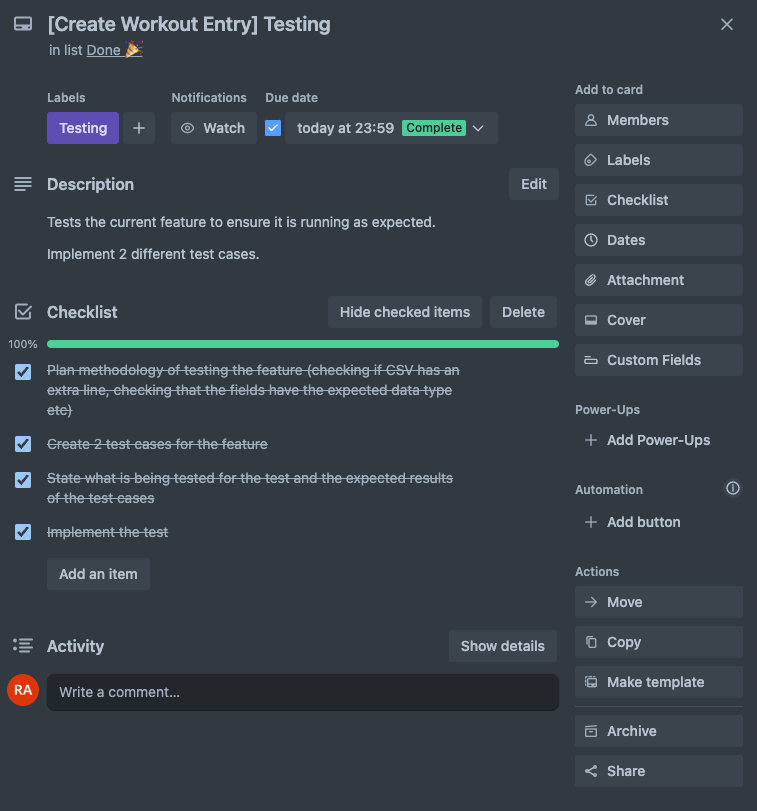

#### Notion Management

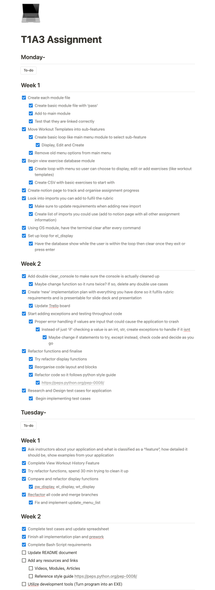

## Help Documentation

### Important Notes

This application has a function which **automatically clears the console**. As a result, starting the application will **immediately** clear the console history once it successfully loads.

Please create a seperate terminal window before starting the application if you have any important terminal history in the console.

For testing, the application comes with pre-exisiting data. This data includes a set of exercises in the database, a few example workout logs and pre-bundled workout templates.

If you do not wish to make use of these and wish to start entirely from scratch, you can delete the CSV files in the **data** folder. I would recommned keeping the *exercises.csv* at the very least to make using the app less tedious.

The application has **not** been tested on Windows systems but should technically work given Python 3 is installed.

It was designed and tested on a Macbook and is only confirmed to work on *Unix-like systems*.

### Dependencies

To run this application, you must have Python 3 installed. The application also makes use of the following dependencies which are automatically set up upon launch.

- colored==2.2.3
- prettytable==3.9.0
- wcwidth==0.2.12

### Installation

To install this app, download the **src** folder containing the source code of the project.

Run the **run.sh** bash script which will set up a virtual environment and start the application for you automatically.

---

### Using the Application

#### Main Menu

Once the application has been started, you'll be greeted by the main menu of the application. From here, you can choose from 4 options.

- Enter Workout Entry Menu
- Enter Workout Templates Menu
- View Exercise List Database

Each of these options takes you to a seperate menu to *create*, *view* or *delete* items from their menu.

If you decided to start from scratch and deleted any of the data files, you will have to create exercise and workout template records in order to utilize the *Workout Entry Menu*.

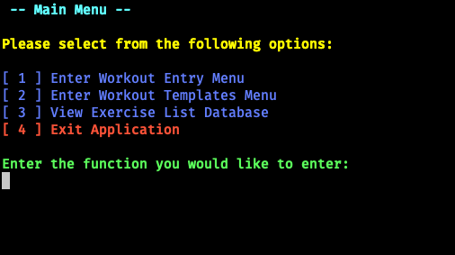

---

#### Creating an Exercise

Upon entering the *Create* function, you'll be prompted to enter the name of the exercise you are creating. The exercise name must be at least **3 characters long** and **cannot** be a number.

You will then be prompted to add your current PB weight for that exercise. This value must be a number which will automatically be turned into a float if it is not one already.

A final confirmation will be shown on the screen along with the details you input. If it looks correct, you can type **YES** to save it or **NO** to abandon it. 

*Please note the **YES** and **NO** inputs are **case sensitive** throughout the application*

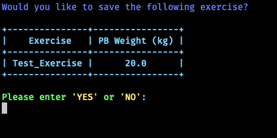

---

#### Creating a Workout Template

You can create your own Workout template by entering the *Create a New Workout Template* menu. You will be prompted to enter the name of the template. The name must be at least **3 characters long** and **cannot** be a number, similar to making a custom exercise.

You will then be prompted to type in the name of the exercises you want to add to this template. Ideally, you will enter the name of an exercise that already exists in the exercise database and it will automatically be added.

In the case that you add an exercise that does not exist in the database, the application will give a warning that the exercise does not exist. You will then have the option to create the exercise and add it to the exercise database before continuing with the template creation.

If you opt to creating an exercise, you will have to give it a current PB value so it can be initialised in the database.

When adding the exercises, make sure to type the name exactly as it would appear in the database or the application will not recognise it.

>For example, if the exercise *Push-ups* is in the database, *Push Ups* would not be recognised as it is missing the **-** symbol.

*The inputs **are not** case sensitive so *Push-Ups* and *push-ups* will automatically be detected correctly.*

After adding all of the exercises you want in the template, you can type **done** to let the application know you are finished.

You will be shown the final template in a table format and the last working weight value (this is automatically set to 0) since no workouts have been completed with the template.

You will be given a confirmation prompt to create the template. Type **YES** to create the template or **NO** to cancel.

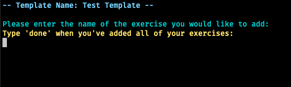

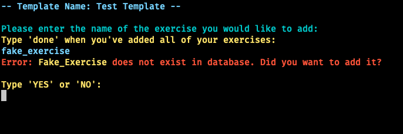

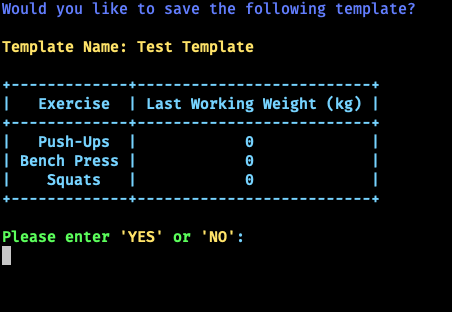

---

#### Creating a Workout Entry

As long as the exercises exist in the exercise database and there are templates to choose from, you can create a workout entry in the application.

Once you enter the *Create a Workout Entry* menu, you will be shown all the available templates to choose from. Select the one which has the exercises you would be completing for that workout.

The app will then iterate through each exercise in the selected template, showing the last recorded weight that the user acheived using that template.

Input the highest weight that you achieved for each exercise for that workout.

Once you've entered the data for each exercise, the application will show a table with the Workout Entry data. If it looks correct, you can type **YES** to save it or **NO** to cancel.

If the user selected **YES**, the workout will be saved to the CSV and can be viewed using the *View all Workout Logs* menu. The workout template will also be updated with the new working weight values from the exercises completed in that workout.

If a new PB was acheived, the application will show a table with all the exercises which have a new PB along with the old recorded PB weight in the exercise database.

Enter **YES** if you want this data to be updated in the exercise database or **NO** if you don't. This does **not** effect the workout log at all as it has already been saved.

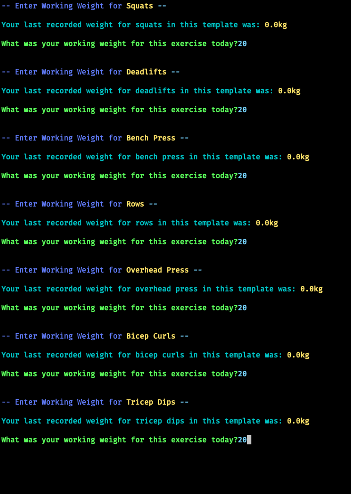

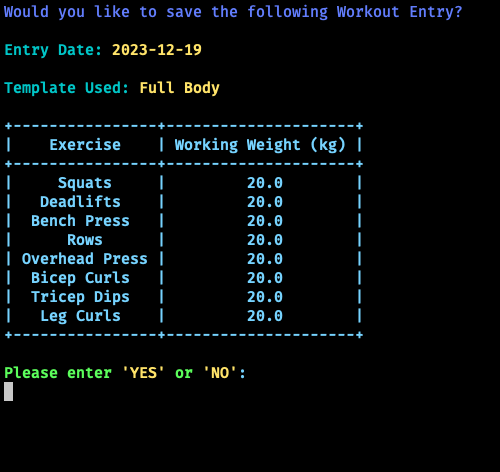

---

#### Viewing a Workout Template or Workout log

Workout logs and templates are displayed in the same way as each other.

You can enter the *View all templates* or *View all Workout Logs*  menu to display all existing templates/logs that have been saved in the application. Entering the menu will display a list of records with an index next to them. Type the index of the record you would like to view and press enter.

The selected log or template will then be displayed in table format with all of the data stored with int.

For Workout templates, a table will be shown with the exercises contained and the *last working weight* that was recorded using that template. The last working weight value gets updated every time a workout is completed using that template.

For Workout Logs, a table will be shown with the exercises completed for that log and the recorded weight for that workout entry.

Press enter or enter any input to leave the menu once you are done.

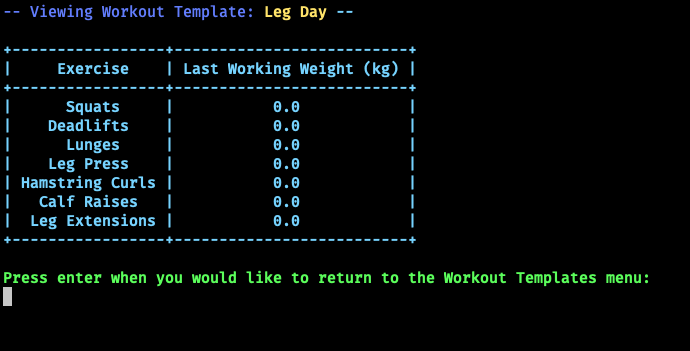

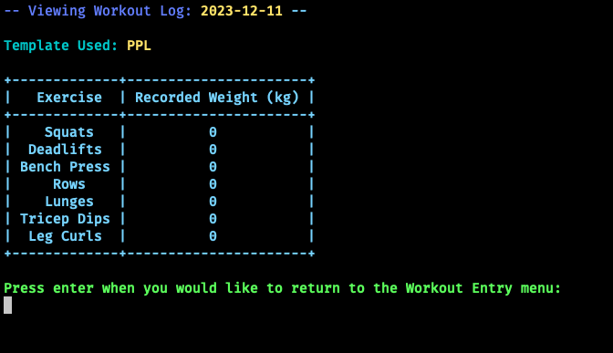

---

#### Viewing the Exercise Database

You can enter the *View all exercises* menu to have a table of all the current existing exercises and PB's display in the terminal. You can press any key or enter any input to leave the menu.

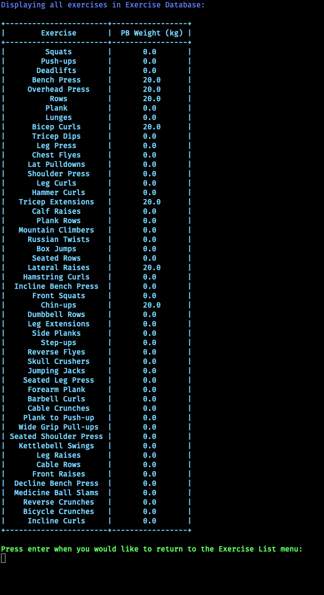

---

#### Deleting an Exercise, Template or Workout Entry

The deletion function works in the same way for Exercise, Templates and Workout logs.

All of the records will be displayed with an index next to them. Type in the number of the record you would like to delete and press enter.

You will be given a confirmation prompt to delete the selected record. Type **YES** to continue with deleting it or **NO** to cancel.

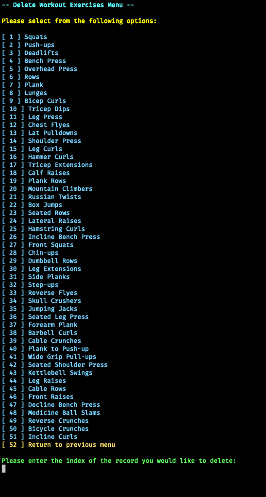

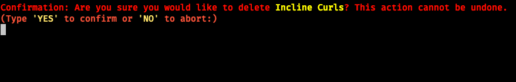

---

## References

Zlatanidis, D. (2023) Colored, PyPI. Available at: https://pypi.org/project/colored/ (Accessed: 11 December 2023).

OS - miscellaneous operating system interfaces (no date) Python documentation. Available at: https://docs.python.org/3/library/os.html (Accessed: 11 December 2023).

Datetime - basic date and time types (no date) Python documentation. Available at: https://docs.python.org/3/library/datetime.html (Accessed: 14 December 2023).

Maurits, L. (2023) Prettytable, PyPI. Available at: https://pypi.org/project/prettytable/ (Accessed: 13 December 2023).

Python eval() (no date) Programiz. Available at: https://www.programiz.com/python-programming/methods/built-in/eval (Accessed: 13 December 2023).

adityaprasad1308 (2021) Python - read CSV columns into list, GeeksforGeeks. Available at: https://www.geeksforgeeks.org/python-read-csv-columns-into-list/ (Accessed: 14 December 2023).

Python enhancement proposals (2023) PEP 8 – Style Guide for Python Code. Available at: https://peps.python.org/pep-0008/ (Accessed: 19 December 2023).
