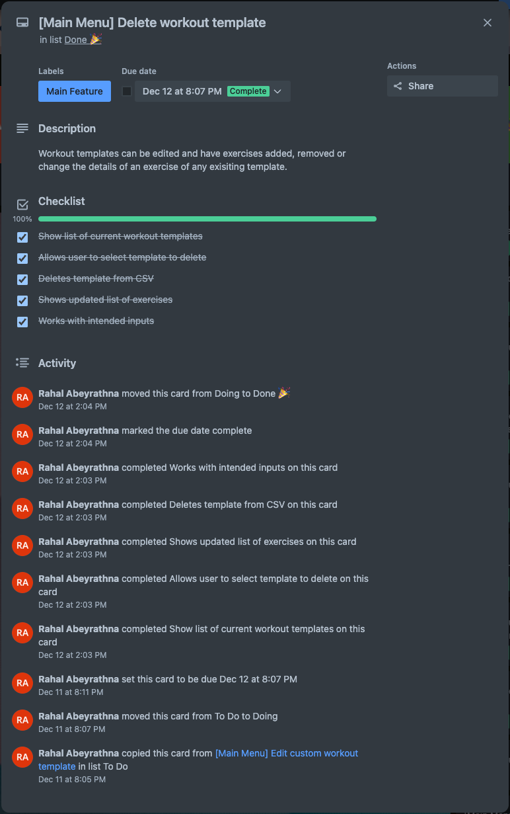
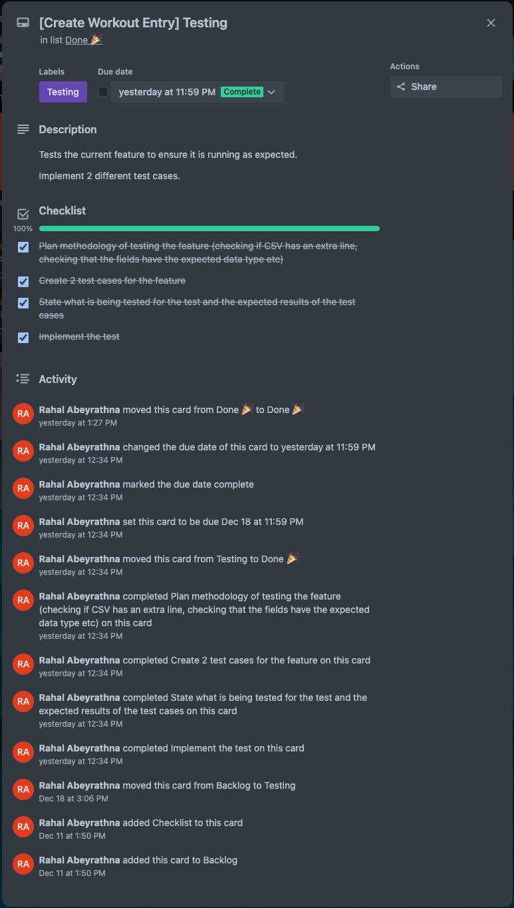

# T1A3 - Terminal Application Rahal Abeyrathna

A terminal application for the Coder Academy T1A3 assignment.

This application is a Workout Tracker that allows the user to create workout templates, custom exercises and to track their exercise personal bests all within the terminal.

[Github Repository](https://github.com/RAbeyrathna/T1A3-Workout-Tracker)

<!-- [Video Presentation]() -->

## Table of Contents

- [Features](#features)
  - [Custom Exercises](#custom-exercises)
  - [Workout Templates](#workout-templates)
  - [Workout Entries](#workout-entries)
- [Code Style Guide](#code-style-guide)
- [Implementation Plan](#implementation-plan)
  - [Project Management Screenshots](#project-management-screenshots)
- [References](#references)
- [Help Documentation](#help-documentation)

## Features

The application has 3 main CSV's which store the data of exercises, workout templates and completed workout logs. These are crucial for the application to work properly and for the main features to be used.

### Custom Exercises

#### Creating Exercises

The user is able to create any custom exercise by inputting an exercise name and their current PB weight for each exercise.This gets automatically saved into the CSV.

#### Viewing Exercises

The user is able to view a table of all exercises that exist within the CSV file.

#### Deleting Exercises

The exercises are listed with an index next to each exercise. The user is able to type in the index associated to an exercise to delete it permanently from the database. The user is given a confirmation prompt before it is completed.

### Workout Templates

#### Creating Templates

Using the exercises in the database, the user is able to create their own workout templates which save a selection of these exercises under a template name for easy access. The template also tracks the users last recorded workout weight for that specific template. This weight gets updated everytime the user completes a workout entry using the selected template.

#### Viewing Templates

The user is also able to view any templates that have been created in the application. They get a selection of the names of the templates and after selecting one, they get to view the exercises and last recorded workout weight of the template in a table format.

#### Deleting Templates

The user can delete any templates from the CSV within the application if they wish to do so. They will be prompted with a confirmation before the deletion is completed.

### Workout Entries

#### Creating Workout Entries

Using the created templates, the user is able to record a workout entry after selecting a template. The entry then iterates through each exercise stored in the template where the user inputs the highest weight they lifted for that exercise. 

If the user breaks any PB's (if the weight they lifted in the workout is higher than the one stored in the database), then the application will offer to save the new PB's into the database.

### Viewing Previous Workout Entries

The user can view any previous workout logs they completed (they will be saved under the date it was completed). The data is shown in a table with the date, template that was used for the workout and a list of the exercise completed and the weight lifted.

#### Deleting Previous Workout Entries

The user can delete any previous workout entries similar to the above features. They can select the index of the entry they would like to delete and are given a confirmation prompt before the entry is permanently deleted.

The workout logs are stored in an external CSV file.

## Code Style Guide

The code was written referencing the [PEP 8 Style Guide for Python](https://peps.python.org/pep-0008/).

## Implementation Plan

I used Trello to manage my overall project and tasks I had to do, as well as Notion to manage my day to day tasks and help check off things I needed to do in the moment or wanted to delegate to another day.

### Project Management Screenshots

#### Main Trello Board

#### Feature Tasks

#### Error Checking

#### Testing

#### Notion Management

## References

Zlatanidis, D. (2023) Colored, PyPI. Available at: https://pypi.org/project/colored/ (Accessed: 11 December 2023).

OS - miscellaneous operating system interfaces (no date) Python documentation. Available at: https://docs.python.org/3/library/os.html (Accessed: 11 December 2023).

Datetime - basic date and time types (no date) Python documentation. Available at: https://docs.python.org/3/library/datetime.html (Accessed: 14 December 2023).

Maurits, L. (2023) Prettytable, PyPI. Available at: https://pypi.org/project/prettytable/ (Accessed: 13 December 2023).

Python eval() (no date) Programiz. Available at: https://www.programiz.com/python-programming/methods/built-in/eval (Accessed: 13 December 2023).

adityaprasad1308 (2021) Python - read CSV columns into list, GeeksforGeeks. Available at: https://www.geeksforgeeks.org/python-read-csv-columns-into-list/ (Accessed: 14 December 2023).

Python enhancement proposals (2023) PEP 8 – Style Guide for Python Code. Available at: https://peps.python.org/pep-0008/ (Accessed: 19 December 2023).

## Help Documentation
